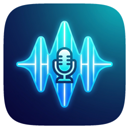

<div align="center">

# 🎚️ SoundDeck



**Virtual audio mixer and soundboard for macOS with keyboard shortcuts**
**Native macOS soundboard and virtual microphone for calls, streams, podcasts, and workshops**

[](https://swift.org)
[](https://www.apple.com/macos)
[](https://developer.apple.com/swiftui)
[](https://swift.org/package-manager)

[Features](#-features) · [Getting Started](#-getting-started) · [Landing Site](#-landing-site) · [Release](#-release) · [Verification](#-verification)

</div>

---

## ✨ Features

- **Virtual Audio Device** — Route sound effects through a virtual microphone for use in video calls, streams, and recordings
- **Hotkey Playback** — Assign keyboard shortcuts to trigger any sound effect instantly
- **Sound Library** — Organize audio files into folders with file picker and drag-and-drop import
- **Headphone Preview** — Preview sounds privately through headphones before playing them on the virtual mic
- **Multi-Format Support** — Import MP3, WAV, M4A, AAC, AIFF, and CAF audio
- **Menu Bar App** — Lightweight, always-accessible interface from the macOS menu bar
- **Audio Driver** — Includes a system audio extension for virtual device functionality
- **Subscription/Licensing** — Built-in licensing system with StoreKit 2 support
- **Auto-Updates** — Sparkle integration for seamless app updates
- **Stop All** — Kill switch to instantly stop all playing sounds
- **Search & Sort** — Filter and sort pads directly from the popover
- **Per-Sound Volume** — Tune individual pad levels without leaving the app

## 🚀 Getting Started

### Prerequisites
- macOS 13.0 or later
- Xcode 15.0+
- Swift 5.9+
- Node.js 20.9+ for the landing site

### Installation

```bash
# Clone the repository
git clone https://github.com/markksantos/sounddeck.git

# Navigate to project directory
cd sounddeck

# Generate Xcode project using XcodeGen
xcodegen generate

# Open the project
open SoundDeck.xcodeproj
```

### Building

1. Open `SoundDeck.xcodeproj` in Xcode
2. Select the SoundDeck scheme
3. Build and run (Cmd+R)
4. Grant audio driver permissions when prompted

### macOS Permissions

SoundDeck needs microphone permission to pass your voice through the virtual mic. The app also installs a CoreAudio HAL driver when you choose Install Driver in onboarding or Settings. The driver can be removed from Settings > Audio Driver > Uninstall.

### Privacy Posture

Audio processing is local to the Mac. SoundDeck does not record or upload microphone audio. Preferences, imported sounds, folders, and hotkeys are stored locally in `~/Library/Application Support/SoundDeck/`.

## 🌐 Landing Site

The public Next.js site lives in `landing/` and includes launch pages, schema, sitemap, robots, `llms.txt`, Open Graph image generation, accessibility-focused FAQ markup, and environment-driven download/checkout URLs.

```bash
cd landing
PATH=/opt/homebrew/Cellar/node@22/22.22.2_1/bin:$PATH npm ci
PATH=/opt/homebrew/Cellar/node@22/22.22.2_1/bin:$PATH npm run lint
PATH=/opt/homebrew/Cellar/node@22/22.22.2_1/bin:$PATH npm run build
```

Production environment variables:

```bash
NEXT_PUBLIC_SITE_URL=https://sounddeck.app
NEXT_PUBLIC_DOWNLOAD_URL=https://sounddeck.app/downloads/SoundDeck-1.0.0-1.zip
NEXT_PUBLIC_CHECKOUT_URL=https://apps.apple.com/account/subscriptions
```

## ✅ Verification

```bash
scripts/verify_app.sh
cd landing && npm run verify
```

`scripts/verify_app.sh` runs SwiftPM tests, unsigned app and installer builds,
Sparkle public-key build-setting substitution, Info.plist checks, release-script
syntax checks, and bundled resource checks.

## 🚢 Release

[RELEASE.md](RELEASE.md) documents the public release flow for Developer ID signing, notarization, Sparkle appcast signing, production landing URLs, and clean-Mac driver smoke testing.

```bash
scripts/verify_release_prereqs.sh
scripts/build_release.sh
ARCHIVE_ZIP=dist/SoundDeck-1.0.0-1.zip scripts/generate_appcast.sh
```

Before public launch, the signed artifact URL must be deployed through `NEXT_PUBLIC_DOWNLOAD_URL`, the purchase destination must be deployed through `NEXT_PUBLIC_CHECKOUT_URL`, and `scripts/smoke_test_driver.sh` must pass on a clean Mac.

## 🛠️ Tech Stack

| Category | Technology |
|----------|-----------|
| Language | Swift 5.9 |
| UI Framework | SwiftUI |
| Build System | XcodeGen, Swift Package Manager |
| Audio | CoreAudio, Audio Unit Extensions |
| Hotkeys | KeyboardShortcuts (SPM) |
| Updates | Sparkle 2.5+ |
| Licensing | StoreKit 2 |
| Platform | macOS 13+ |

## 📁 Project Structure

```
sounddeck/
├── SoundDeckApp/           # Main application
│   ├── App/                # Core app logic and delegates
│   ├── Audio/              # Audio playback and routing
│   ├── Hotkeys/            # Keyboard shortcut management
│   ├── Views/              # SwiftUI views
│   ├── Models/             # Data models
│   ├── Services/           # Audio services and managers
│   ├── Subscription/       # StoreKit integration
│   └── Licensing/          # License validation
├── SoundDeckDriver/        # Audio driver extension
├── SoundDeckCommon/        # Shared code between app and driver
├── SoundDeckInstaller/     # Driver installation utility
├── Tests/                  # Unit tests
├── Resources/              # Assets and resources
├── landing/                # Next.js public marketing/docs site
├── project.yml             # XcodeGen configuration
└── Package.swift           # Swift Package Manager manifest
```

## 📄 License

MIT License © 2026 Mark Santos
